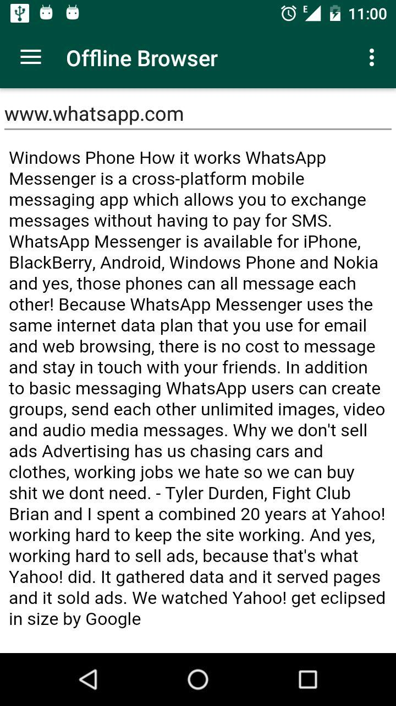
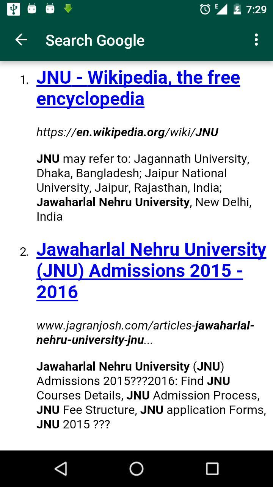
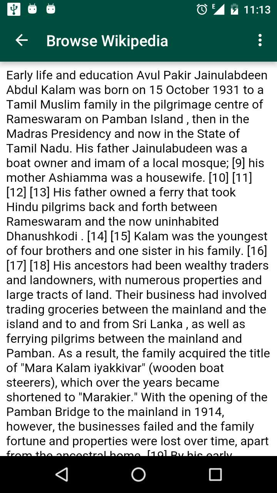

# Offline-Browser-Android-App
SMS Based Browser for Android Devices for Retrieving Web Contents without WiFi/Internet,Done for Final Year Project 2015-2016

Offline Browser Lets tou to browse websites,wiki documents and make a web search even without any data/wifi.My Application makes use
of standard SMS to make a request to our server,the request contains the web address that you need to browse.

The request is then sent to configured phone no,which then forwards it to our backend.the configured device which receives the request
is installed with an app called "Post Man" which can be found on my repo lists.Post man listens for all incoming SMS's that are from 
offline browser and sends those requests to the server which is responsible for converting the requests web address into textual format.

The Output of the server,which is textual version of the requested page is forwarded to a Node.js service which handles the operation
of sending the result as a sequence of SMS to the requested User via our SMS API.

Following are the various screen shots of our Offline Browser in action : 

1) When Requested for a web address: 

2) When searched for JNU 

3) Wiki document for Abdul Kalam

